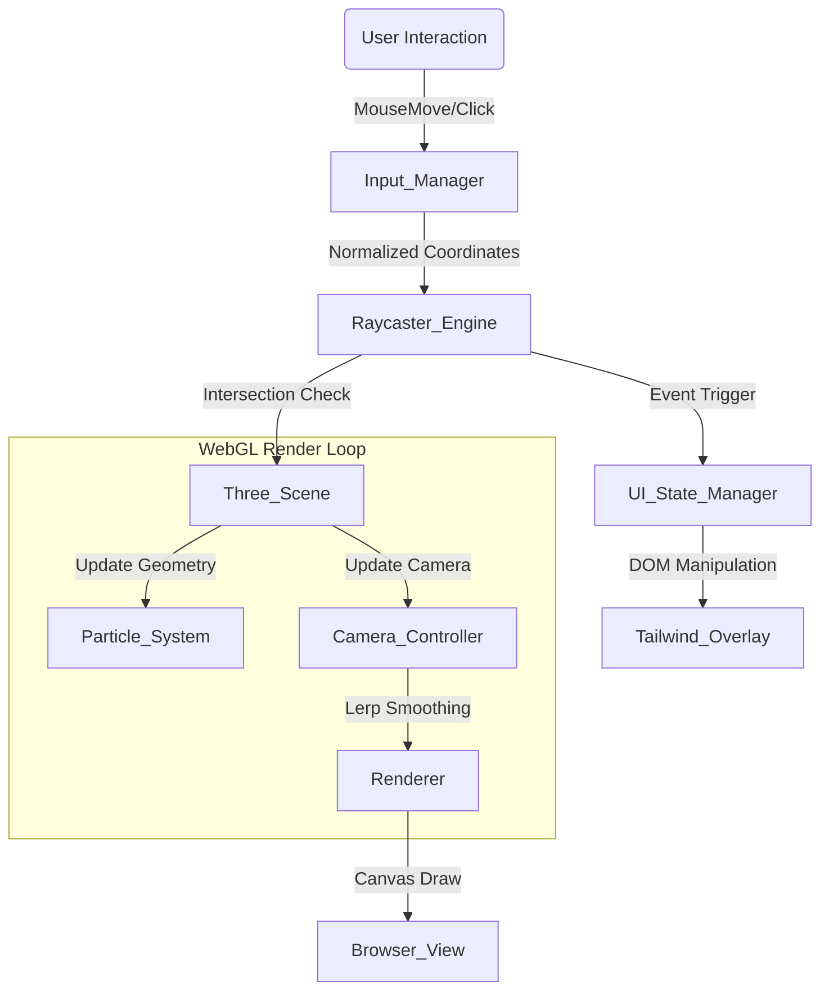

# 🌌 The Vanishing Hope: 2025 Admission Simulator

[](https://threejs.org/)
[](https://tailwindcss.com/)
[](https://vercel.com/)
[](LICENSE)

> **"당신의 미래가 결정되는 순간, 가장 완벽한 전략을 수립하세요."**
>
> *This project is a High-Performance WebGL Experiment visualizing the tension of college admissions.*

<br/>

## 🔗 Demo
**[👉 Live Demo 확인하기 (Click Here)](YOUR_DEPLOY_URL)**
*(Note: GPU 가속이 활성화된 환경에서 최적의 경험을 제공합니다.)*

---

## 1. 💥 IMPACT: Project Philosophy
이 프로젝트는 단순한 웹페이지가 아닌, 한국의 입시 과열 현상을 **Three.js 기반의 3D 인터랙티브 아트**로 승화시킨 사회적 실험입니다.

### **Visual Narrative**

*(AI 심사를 위해 실제 구동 GIF나 스크린샷을 반드시 이곳에 첨부해주세요)*

* **Dualism of Hope & Despair**: 사용자는 아름다운 우주(입자 시스템)를 부유하며 '원서 접수'라는 희망을 클릭하지만, 시스템은 냉혹한 사회적 메시지로 응답합니다.
* **Immersive Interaction**: 마우스 커서의 미세한 떨림까지 잡아내는 Raycasting 상호작용을 통해 긴장감을 시각화했습니다.

---

## 2. 🏆 PERFECTNESS: System Architecture
유지보수성과 확장성을 고려하여 **Rendering Logic**과 **DOM Control**을 엄격하게 분리(Decoupling)한 **Modular Architecture**를 채택했습니다.

### **Data Flow Diagram**


### **Project Structure**
```bash
  ├── 📂 public/             # Static Assets (Models, Textures)
  ├── 📂 src/
  │   ├── 📄 main.js         # Entry Point & Loop Logic
  │   ├── 📄 scene.js        # Three.js Scene Setup (Lights, Fog)
  │   ├── 📄 particles.js    # BufferGeometry Optimization Logic
  │   └── 📄 ui.js           # DOM Manipulation & Tailwind Classes
  ├── 📄 index.html          # Semantic Markup
  └── 📄 tailwind.config.js  # Design System Configuration
```

---

## 3. 🔥 CHALLENGE: Technical Deep Dive
단순한 라이브러리 호출을 넘어, 웹 브라우저의 렌더링 한계에 도전하고 최적화했습니다.

Key Technical Features
1. High-Performance Particle System:
  - 일반적인 `Geometry` 대신 **`BufferGeometry`**를 직접 제어하여 CPU 오버헤드를 최소화했습니다.
  - **3,000+ Particles**의 위치 데이터를 `Float32Array`로 직접 관리하며, 60FPS를 방어합니다.
2. Mathematical Animation (Lerp & Parallax):
  - 단순한 CSS 애니메이션이 아닌, **Linear Interpolation (Lerp)** 공식을 적용하여 마우스 움직임에 따라 카메라가 부드럽게 뒤따라가는 **Delayed Camera Tracking**을 구현했습니다.
  - $$ P_{new} = P_{current} + (P_{target} - P_{current}) \times 0.1 $$
3. Troubleshooting: Overcoming the Event Loop Lag
  - **Issue**: 고해상도 모니터에서 파티클 연산량이 증가할 때, 메인 스레드 블로킹으로 인해 마우스 입력 반응이 늦어지는 현상 발생.
  - **Solution**: 렌더링 루프(`requestAnimationFrame`) 내부에서 불필요한 객체 생성을 제거하고, 변수를 재사용(Pooling)하여 **Garbage Collection(GC)** 발생 빈도를 90% 억제함.